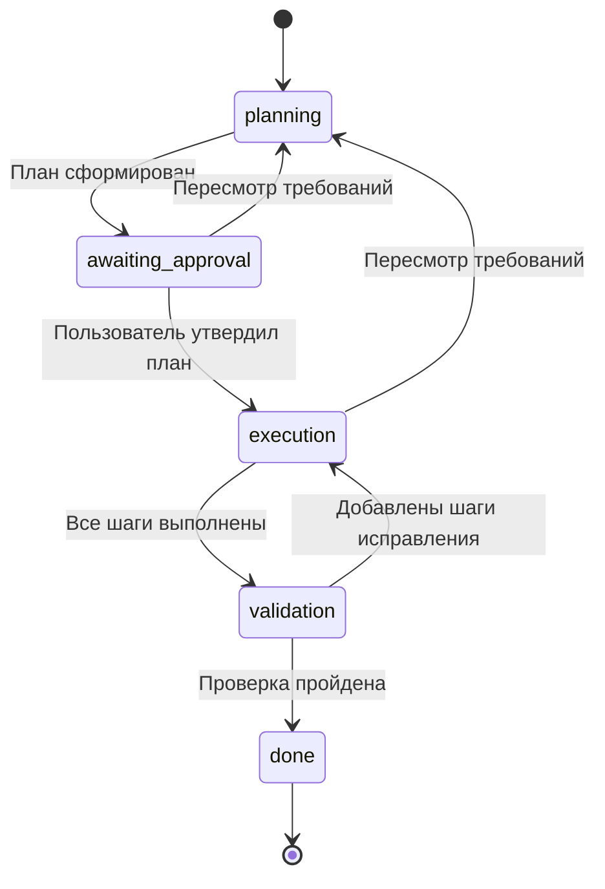

# День 13. Состояние задачи

В Дне 15 автомат дополнен явным ожиданием утверждения и строгими событиями:
[контролируемые переходы](day15-controlled-transitions.md).

Агент выполняет задачу по сохранённому снимку `TaskContext`. В нём находятся
цель, этап, число завершённых шагов, план, критерии, результаты и уточнения
пользователя. Текущий шаг, число шагов и ожидаемое действие вычисляются из
снимка, поэтому не могут разойтись с планом и прогрессом.

## Автомат



Формирование плана происходит в `planning`, ожидание его утверждения — в `awaiting_approval`.
Выполнение делает ровно один шаг за запрос. Проверка получает исходную цель,
требования, критерии и сохранённые результаты. При ошибках добавляются новые
шаги, а готовые результаты остаются на месте. `done` — терминальный этап.

Пауза хранится отдельным флагом. Она доступна в планировании, выполнении и
проверке, включая ожидание утверждения плана. «Продолжить» снимает флаг,
сохраняя ожидаемое действие; генерация запускается отдельной кнопкой.
Если пауза пришла во время вызова модели, ответ сохраняется вместе с флагом
паузы. Если уже начатая проверка успешно завершила задачу, итог сохраняется
в `done`: завершённая задача не остаётся на паузе.

## Код

- `app/state/task.py` — неизменяемые dataclass, таблица переходов и правила прогресса;
- `app/agents/task_outputs.py` — строгие схемы ответов планирования и проверки;
- `app/agents/agent.py` — обработчики этапов, получающие полный снимок задачи;
- `app/orchestration/tasks.py` — выбор этапа агента и применение переходов;
- `app/orchestration/context.py` — активный профиль отдельно от памяти и состояния задачи;
- `app/memory/context.py` — отдельный снимок working и long-term memory;
- `app/storage/chat_sessions.py` — SQLite, атомарное сохранение снимка и сообщений, версии состояния;
- `app/services/chat_sessions.py` — координация запроса и адаптация HTTP-моделей;
- `app/main.py` и `app/schemas.py` — API задач;
- `static/` — схема этапов над чатом, цепочка шагов в правой панели и управление задачей;
- `tests/test_task_state.py` и `tests/test_tasks.py` — проверки переходов и полного цикла.

Переходы применяет backend. Ответ модели не может произвольно установить
этап или перезаписать прогресс. Некорректный JSON, пустой результат или ошибка
провайдера оставляют последний снимок и историю без изменений.

Планирование и проверка используют JSON-режим DeepSeek. Для проверки выделено
8000 токенов вместо обычных 2000, поскольку её ответ включает полный итоговый
материал. Обрезанный структурированный ответ не склеивается с продолжениями:
в thinking-режиме запрос один раз повторяется целиком без thinking. Если и он
не завершился, этап остаётся прежним и интерфейс сообщает об обрезанном JSON.
Нарушение схемы и сбой провайдера также отображаются отдельными сообщениями.
В диагностические логи попадают типы ошибок и HTTP-статус провайдера, без тела
ответа, исходной задачи, профиля и памяти.

У каждого снимка есть `revision`. Изменение плана или прогресса также увеличивает
внутренний `progress_revision`; пауза и продолжение меняют только `revision`.
Это позволяет сохранить результат уже начатого действия после паузы, сохранив
актуальный флаг, и отклонить результат с устаревшим прогрессом.

Утверждение плана подтверждает, что пользователь согласен с шагами и критериями.
Проверка результата — оценка языковой модели по этим критериям; у агента нет
инструментов для проверки внешних фактов или выполнения действий в окружении.

## Процесс в интерфейсе

Над историей находится компактная схема пяти этапов. Готовые этапы отмечаются
галочками, активный выделен, а во время запроса подсвечивается анимацией.
Счётчик показывает число сохранённых шагов, а не предполагаемый процент работы модели.

В правой панели можно переключаться между «Процессом» и «Памятью». Процесс
показывает весь план как цепочку шагов: выполненные, текущий и будущие.
Критерии и сохранённые результаты раскрываются в этой панели, не занимая историю чата.
Кнопки действий стоят под историей вместо отключённого поля сообщения.

Во время генерации в чате появляется карточка текущего действия с анимацией
ожидания и временем запроса. После ответа её заменяет сохранённый результат.
Пауза во время запроса выделяется отдельным цветом и показывает, что текущий
ответ ещё сохраняется. При ошибке индикатор прекращается и действие можно повторить.
Внутренние шаги рассуждений и точный прогресс модели API не передаёт.

## Сценарий для видео

Запустите приложение по README с настроенным DeepSeek. Покажите цель:
Для нового профиля сначала завершите интервью или отправьте `/skip` в обычном чате.

> Подготовь программу ровно двух занятий по Python для новичков.
> Для каждого занятия укажи тему, ожидаемый результат обучения и одно
> практическое задание. Раздели подготовку на два шага: темы и практика.

1. В новом чате нажмите «Создать задачу». Покажите `planning` и ожидаемое действие «Сформировать план».
2. Поставьте паузу. Обновите страницу: этап и ожидаемое действие сохранились. Нажмите «Продолжить».
3. Сформируйте план. Покажите шаги и критерии, затем нажмите «Утвердить план».
4. Выполните первый шаг. Покажите сохранённый результат, прогресс и следующий шаг.
5. Поставьте паузу в `execution`. Остановите и снова запустите backend с тем же `CHAT_DB_PATH`.
6. Обновите страницу. Покажите прежний прогресс и готовый результат. Нажмите «Продолжить», затем «Выполнить шаг» без повторного описания задачи.
7. В `validation` снова поставьте паузу и снимите её. Нажмите «Проверить результат».
8. Если проверка предложила исправления, выполните добавленные шаги и повторите проверку. Покажите `done` и итоговый материал.

Для дополнительной демонстрации можно пересмотреть план после первого шага.
Укажите новые требования и покажите готовый материал в «Сохранённых результатах»
как результат предыдущего плана. Новые шаги снова требуют утверждения.

## Проверки

```bash
python -m pytest -q
python -m compileall -q app tests
node --check static/app.js
```

Тесты используют подставную модель и проверяют паузу на всех рабочих этапах,
восстановление после перезапуска, ошибки провайдера и некорректные ответы,
возврат на исправления, пересмотр плана, устаревшие запросы, параллельный запуск,
паузу во время генерации, независимость от обрезки истории и сохранность старых чатов.
Отдельно проверяются передача профиля и его памяти на всех этапах задачи и
изоляция задач при переключении или очистке профилей.
